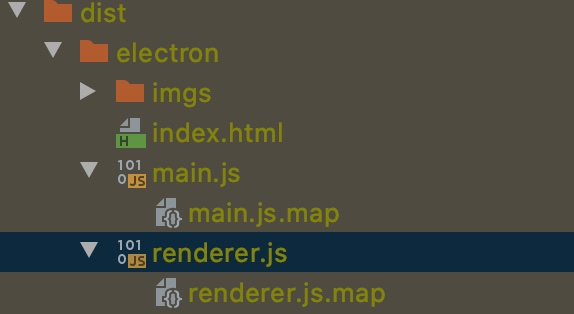

# electron-vue

> An electron-vue project with sentry

### 接入Sentry
#### 1. 下载SDK
官方给出的下载方式有点坑.首先需要全局下载 `@sentry/electron` 和 `@sentry/integrations`
在renderer/main.js和main/index.js加入以下代码:
```javascript
//renderer/main.js
//写法1:renderer进程需要增加vue的integration
import { Vue as VueIntegration } from '@sentry/integrations'
import * as Sentry from '@sentry/electron'
Sentry.init({
  dsn: 'https://XXX.ingest.sentry.io/XXX', //你的dsn
  integrations: [
    new VueIntegration({
      Vue,
      attachProps: true,
      logErrors: true
    })
  ],
})
//electron的crash日志上传
crashReporter.start({
  productName: 'yourProductName',
  companyName: 'yourCompanyName',
  submitURL: 'https://XXX.ingest.sentry.io/XXX', //和dsn地址一样
  uploadToServer: true
})
//写法2:
const { init, getIntegrations } = require('@sentry/electron')
const VueIntegration = getIntegrations().browser.Vue
init({
  dsn: 'https://xxx@report.url.cn/sentry/xxx',
  debug: true,
  integrations: [new VueIntegration()]
})
crashReporter.start({
  productName: 'yourProductName',
  companyName: 'yourCompanyName',
  submitURL: 'https://XXX.ingest.sentry.io/XXX', //和dsn地址一样
  uploadToServer: true
})
```
<HR>

```js
//main/index.js
import { init } from '@sentry/electron'
/*
  如果出现TypeError: mod.require is not a function,
  加上 import * as Sentry from '@sentry/electron'
*/
init({dsn: 'https://966c9d6a96ab4c2d8d2367709fcf81da@o410650.ingest.sentry.io/5287742'})
crashReporter.start({
  productName: 'yourProductName',
  companyName: 'yourCompanyName',
  submitURL: 'https://XXX.ingest.sentry.io/XXX', //和dsn地址一样
  uploadToServer: true
})
```
#### 2. 注入错误
可以简单的写一个错误,然后刷新sentry,如果出现则说明接入成功,如果没有则看看第一步是否有错误.没上传sourcemap的错误信息是这样

#### 3. 配置sourcemap
如果有错误显示了,则需要上传项目的sourcemap,且必须有map文件sentry才能做到映射,否则无法查看相关的错误代码行,所以要对
`webpack.main.config.js` 和 `webpack.main.config.js` 做一下配置,
这里选择建议hidden-source-map.
```javascript
//webpack.main.config.js
const SentryCliPlugin = require('@sentry/webpack-plugin')

let mainConfig = {
  devtool: '#cheap-module-eval-source-map',
  entry: {
    main: path.join(__dirname, '../src/main/index.js')
  },
  //  ....
  plugins: [
    new webpack.NoEmitOnErrorsPlugin()
  ]
  //...
}
if (process.env.NODE_ENV === 'production') {
  mainConfig.devtool = 'hidden-source-map'
  //...
}
```
<hr>
webpack.renderer.config.js 同理 略

#### 4. npm run build 打包
#### 5. 根目录创建.sentrycli
```
[auth]
token=api-key(点击头像那可以申请)

[defaults]
url = https://sentry.io(或者公司自己的)
org = watanabesayuri(你的组织名,必须填对)
project = electron-vur(你的项目名,必须填对)
```

#### 6. 上传sourcemap
打包成功可以在dist/electron文件下看到对于js的map

##### 6.1 手动上传
版本号可以在错误日志里看,

`sentry-cli releases files <版本号> upload-sourcemaps --url-prefix <线上资源URI，这里要和你的url所在位置进行对应> <打包出来的js和map文件所在目录>`
electron-vue项目下.如果没进行修改默认entry和output配置,一般url-prefix为'app:///dist/electron/'.上传成功后可以看到文件
`sentry-cli releases files electron-vue0.0.1 upload-sourcemaps --url-prefix 'app:///dist/electron/' './dist/electron/'` <br>
**Hint:如果是vue-cli的web项目.url-prefix默认是`'~/js'`,include地址是'`./dist/js'`**

#### 6.2 @sentry/webpack-plugin打包自动上传
需要在`main/index.js`,`renderer/main.js`,`webpack.renderer.config.js`,`webpack.main.config.j`s中加入一致的release.
```javascript
//main/index.js
import { init } from '@sentry/electron/dist/main'
import * as Sentry from '@sentry/electron'
init({
  dsn: 'https://966c9d6a96ab4c2d8d2367709fcf81da@o410650.ingest.sentry.io/5287742',
  release: 'demo-1', //对于sentryWebpackPlugin必须
})
```
```javascript
//renderer/main.js
import { Vue as VueIntegration } from '@sentry/integrations'
import * as Sentry from '@sentry/electron'
Sentry.init({
  dsn: 'https://966c9d6a96ab4c2d8d2367709fcf81da@o410650.ingest.sentry.io/5287742',
  release: 'demo-1', //对于sentryWebpackPlugin必须
  integrations: [
    new VueIntegration({
      Vue,
      attachProps: true,
      logErrors: true
    })
  ],
})
```
```javascript
//main和renderer的webpack
const SentryCliPlugin = require('@sentry/webpack-plugin')
module.exports = {
  plugin:[
    ...
       new SentryCliPlugin({
          include: "./dist/electron/", // 作用的文件夹，如果只想js报错就./dist/js
          configFile: ".sentryclirc", // 不用改
          release: 'demo-1', //对于sentryWebpackPlugin必须
          ignore: ['node_modules'],
          urlPrefix: "app:///dist/electron/",//这里指的你项目需要观测的文件如果你的项目有publicPath这里加上就对了
        })
  ]
}
```
#### 7. 打开打包后的文件运行
运行后再现一下错误,sentry日志就会更新.然后就可以看到错误代码行啦

#### Build Setup 

``` bash
# install dependencies
npm install

# serve with hot reload at localhost:9080
npm run dev

# build electron application for production
npm run build


```

---

This project was generated with [electron-vue](https://github.com/SimulatedGREG/electron-vue)@[45a3e22](https://github.com/SimulatedGREG/electron-vue/tree/45a3e224e7bb8fc71909021ccfdcfec0f461f634) using [vue-cli](https://github.com/vuejs/vue-cli). Documentation about the original structure can be found [here](https://simulatedgreg.gitbooks.io/electron-vue/content/index.html).

